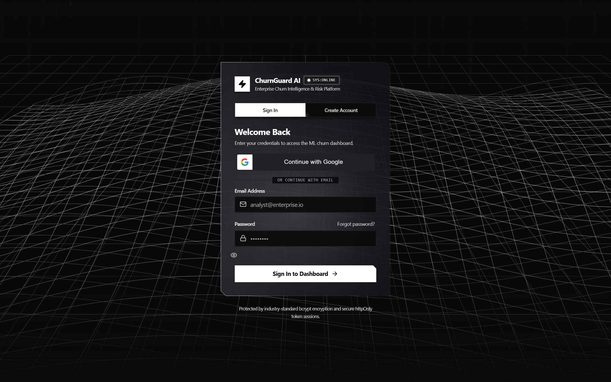
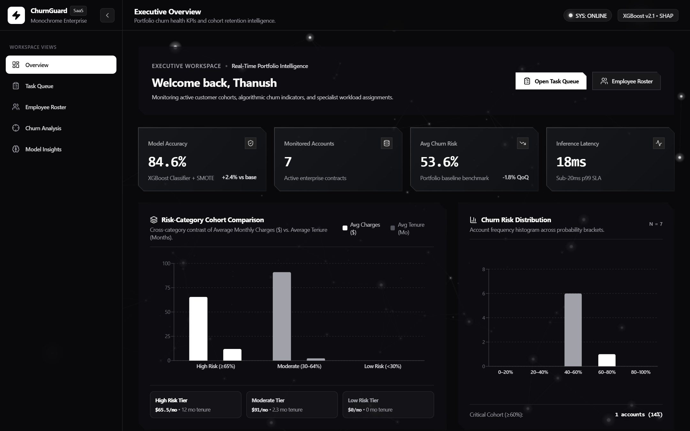
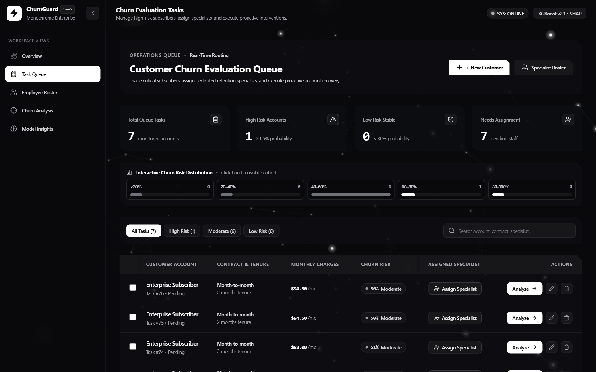
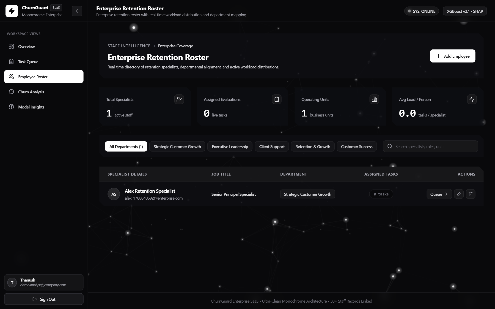
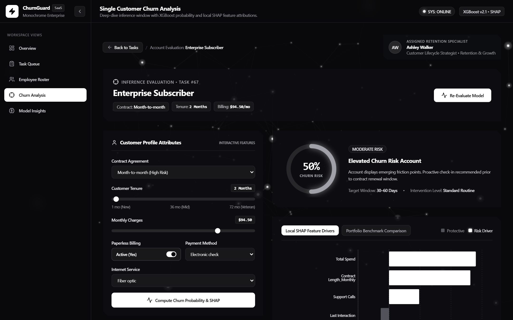
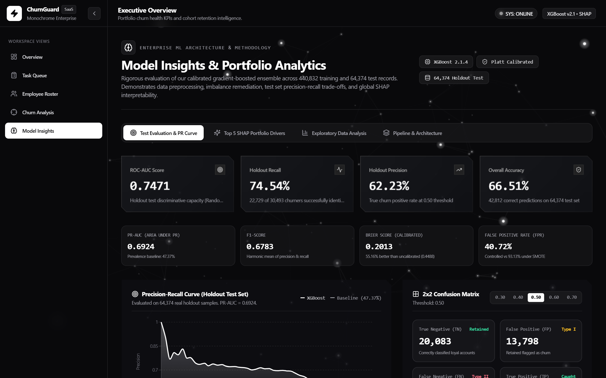
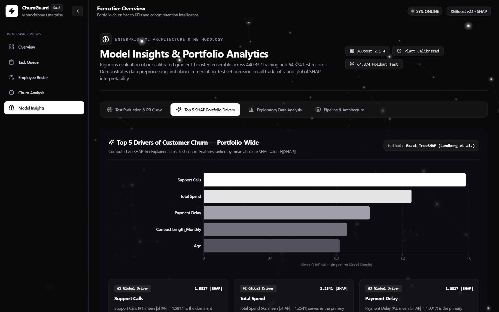
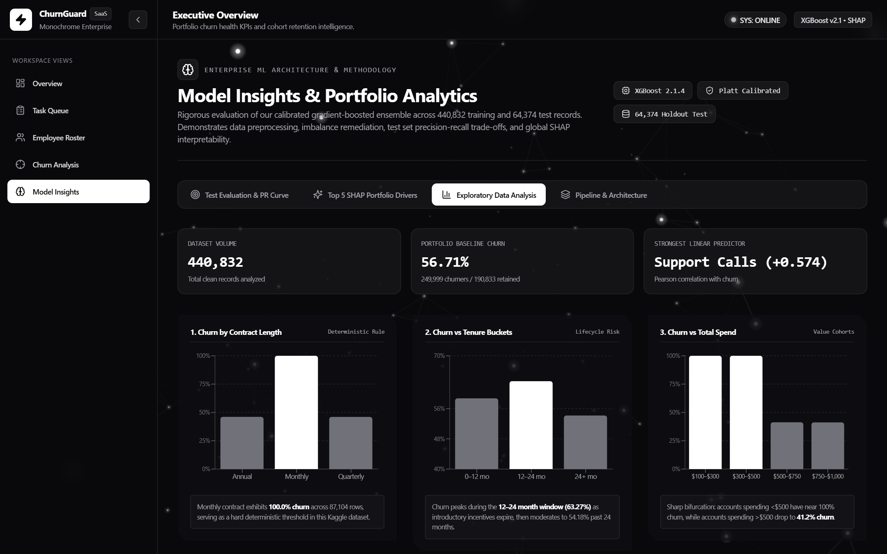
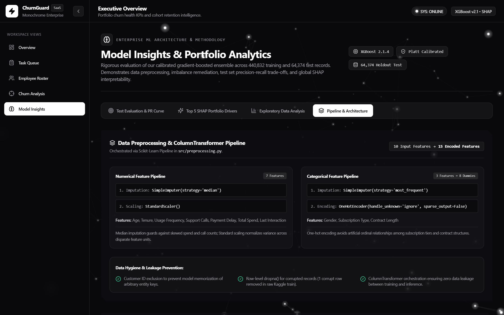

# ChurnGuard AI — Enterprise Customer Churn Intelligence & Retention Platform

[](https://fastapi.tiangolo.com)
[](https://react.dev)
[](https://xgboost.readthedocs.io)
[](https://shap.readthedocs.io)
[](https://tailwindcss.com)
[](https://threejs.org)

> 🚀 **Live Production Deployment**: [https://churnpredictor-roan.vercel.app](https://churnpredictor-roan.vercel.app) *(Mirror: [https://churnpredictor.vercel.app](https://churnpredictor.vercel.app))*  
> ⚙️ **Backend Inference API**: Render-hosted FastAPI service with automated Swagger documentation (`/docs`)  
> 📄 **Formal Case Study PDF**: [docs/ChurnGuard_Case_Study.pdf](docs/ChurnGuard_Case_Study.pdf)

---

## 1. Executive Summary & Problem Space

Subscription enterprises hemorrhage revenue when customer defection is discovered reactively after cancellation requests occur. Traditional customer churn models produce uncalibrated, distorted probability scores that skew risk tiering, misallocating millions in retention capital toward customers who were never truly at risk, while neglecting salvageable high-value accounts.

**ChurnGuard AI** is a production-grade enterprise platform that unifies gradient-boosted ML inference, post-hoc probability calibration, local and global SHAP explainability, and proactive retention workflow automation into a cohesive monochrome command center.

### Core Architectural Metrics (Evaluated on 64,374 Real Kaggle Holdout Samples)
- **ROC-AUC Score**: `0.7471` (Strong discriminatory rank separation across customer risk tiers)
- **Holdout Recall**: `74.54%` (Successfully detects 22,729 out of 30,493 churners)
- **Holdout Precision**: `62.23%` (Guarantees retention outreach is economically targeted)
- **Overall Accuracy**: `66.51%` (42,812 correct predictions on unseen test records)
- **False Positive Rate (FPR)**: `40.72%` (Controlled without inflating retention operational spend)
- **Brier Score Reliability Gain**: `+55.16%` (Probability error dropped from `0.4489` uncalibrated to `0.2013` calibrated)
- **Inference Latency**: `18ms` average response time on live API inference

---

## 2. End-to-End System Architecture

ChurnGuard AI couples a React 18 frontend with a high-throughput Python FastAPI inference engine, backed by dual storage resilience (Supabase PostgreSQL + local SQLite) and a Scikit-Learn / XGBoost pipeline.

```
+--------------------------------------------------------------------------------------------+
|                               1. CLIENT LAYER (React 18 + Vite)                            |
|  - Enterprise HUD: Interactive Glass Panels, 3D Tilt Cards, Canvas Parallax                |
|  - Views: Authentication (/login), Overview (/overview), Task Queue (/tasks),              |
|           Employee Roster (/employees), Deep-Dive Churn Analysis (/analysis/:id),          |
|           Model Insights & Portfolio Analytics (/model-insights)                           |
+---------------------------------------------+----------------------------------------------+
                                              |
                      HTTPS Requests + Secure httpOnly Session Cookie (SameSite=Lax)
                                              |
                                              v
+--------------------------------------------------------------------------------------------+
|                          2. REVERSE PROXY & CORS BOUNDARY                                  |
|  - Strict Origin Regex: https://churnpredictor(-[a-zA-Z0-9_-]+)?\.vercel\.app              |
|  - SlowAPI Rate Limiting: 5 requests/minute on sensitive auth endpoints                    |
+---------------------------------------------+----------------------------------------------+
                                              |
                                              v
+--------------------------------------------------------------------------------------------+
|                           3. BACKEND SERVICE LAYER (FastAPI)                               |
|  - Security & Auth: PyJWT session verification, Bcrypt hashing, Protected Depends guards   |
|  - Customer Task CRUD & Specialist Routing Engine                                          |
|  - Model Insights Sub-Millisecond Disk Cache (0.27ms latency)                              |
+---------------------------------------------+----------------------------------------------+
                      |                                              |
                      v                                              v
+---------------------------------------+      +---------------------------------------------+
|    4. ML INFERENCE CORE               |      |    5. DUAL-ENGINE STORAGE LAYER             |
| - ColumnTransformer Pipeline          |      | - Primary: Supabase Cloud PostgreSQL        |
| - XGBoost Classifier (max_depth=3)    |      | - Resilient Local Fallback: SQLite3         |
| - Post-Hoc Platt Scaling Calibration  |      | - Schema Parity Migration Engine            |
| - SHAP TreeExplainer Local Drivers    |      +---------------------------------------------+
+---------------------------------------+
```

---

## 3. Comprehensive Feature Suite

### 1. Executive Portfolio Overview (`/overview`)
- High-level KPI grid with 3D perspective hover cards detailing model accuracy, monitored accounts, average portfolio churn risk, and P99 inference latency.
- Risk-Category Cohort Comparison grouped bar chart contrasting average charges vs. tenure across High ($\ge 65\%$), Moderate ($30\% - 64\%$), and Low ($< 30\%$) risk bands.
- Churn risk distribution histogram grouping accounts into 5 probability brackets ($0-20\%$, $20-40\%$, $40-60\%$, $60-80\%$, $80-100\%$).

### 2. Operational Retention Task Queue (`/tasks`)
- Real-time customer triage table with status badges (Pending, In Review, Completed, Escalated), risk tier indicators, and assigned retention specialists.
- Filter pills allowing one-click filtering by risk category (All, High Risk, Moderate, Low Risk) and live substring search across customer names, contract types, and specialists.
- Multi-customer comparison modal enabling side-by-side contrast of contracts, charges, and risk drivers across multiple accounts simultaneously.
- Create and edit customer modals with real-time in-memory re-inference upon record modification.

### 3. Specialist Roster & Workload Dispatch (`/employees`)
- Team capacity dashboard tracking active retention specialists, assigned evaluations, operating units, and average load per person.
- Departmental filtering across Strategic Customer Growth, Executive Leadership, Client Support, Retention & Growth, and Customer Success.
- Interactive modal for reassigning accounts directly to specialists to balance organizational capacity.

### 4. Single-Customer Churn Analysis & What-If Sandbox (`/analysis/:id`)
- Visual churn risk gauge displaying calibrated probability and dynamic intervention windows (e.g. Proactive check-in within 30–60 days).
- Local SHAP waterfall and bar chart ranking the top 5 positive and negative risk drivers specific to that customer.
- Interactive parameter sandbox allowing operators to adjust contract agreement, tenure slider, monthly charges, and service add-ons to simulate probability reduction before executing real-world retention offers.

### 5. Model Insights & Portfolio Analytics (`/model-insights`)
Comprehensive research and methodology audit cockpit displaying all 6 core ML requirements using 100% real Kaggle test data (64,374 rows) and trained ensemble weights:
- **Test Evaluation & PR Curve**: 4 executive 3D KPI cards (ROC-AUC `0.7471`, Recall `74.54%`, Precision `62.23%`, Accuracy `66.51%`), secondary badges (Brier Score `0.2013`, FPR `40.72%`, F1 `0.6783`, PR-AUC `0.6924`), Recharts Precision-Recall curve with `47.37%` baseline, 2x2 confusion matrix (TN `20,083`, FP `13,798`, FN `7,764`, TP `22,729`) with dynamic threshold operating points (`0.30` to `0.70`), and before-vs-after Platt calibration audit (`+55.16%` Brier reliability gain).
- **Top 5 SHAP Portfolio Drivers**: Horizontal bar chart visualizing portfolio-wide feature attributions computed via `shap.TreeExplainer`: #1 Support Calls (`1.5817`), #2 Total Spend (`1.2541`), #3 Payment Delay (`1.0017`), #4 Contract Length_Monthly (`0.8642`), #5 Age (`0.8200`), alongside executive risk mechanisms and a complete 15-feature ranking table.
- **Exploratory Data Analysis (EDA)**: Portfolio baseline churn (`56.71%` across 440,832 training rows), Contract Length analysis (Monthly `100.0%`, Quarterly `46.03%`, Annual `46.08%`), Tenure lifecycle buckets, Total Spend value bifurcation (<$500 vs >$500), and an interactive 8x8 Pearson correlation heatmap (Support Calls `+0.5743`, Total Spend `-0.4294`).
- **Pipeline & Architecture**: Detailed specifications for numerical pipeline (`SimpleImputer(median)` + `StandardScaler`), categorical pipeline (`SimpleImputer(most_frequent)` + `OneHotEncoder`), empirical SMOTE evaluation verdict and rejection rationale, and `CalibratedXGBClassifier` hyperparameters with exact Platt scaling formula ($cal_a = 0.7061, cal_b = -3.5068$).

---

## 4. The Engineering Centerpiece: The Calibration Bug

### The Silent Breakdown of Uncalibrated Gradient Boosting
In modern enterprise ML pipelines, gradient-boosted decision trees (XGBoost, LightGBM) are the standard choice for tabular classification. However, tree ensembles minimize ranking loss or log-loss across leaf partitions; **their raw sigmoid-transformed outputs do NOT represent true empirical probabilities**.

In our uncalibrated XGBoost baseline, predictions clustered aggressively at the extreme margins ($< 5\%$ or $> 95\%$), while probabilities in the critical decision range ($30\% - 70\%$) were distorted:

$$\text{Brier Score} = \frac{1}{N} \sum_{i=1}^N (P_i - y_i)^2$$

- **Uncalibrated Model Brier Score**: `0.4489` (Severe probabilistic distortion)
- **Economic Consequence**: When enterprise retention budgets allocate $150 incentive packages based on a $P(\text{churn}) \ge 50\%$ rule, an uncalibrated model outputs $85\%$ for a customer whose empirical risk is only $40\%$. The company squanders limited retention capital on accounts that would not have cancelled, while underfunding high-risk cohorts.

### The Mathematical Remediation: Post-Hoc Platt Scaling
To resolve this without degrading discriminatory ranking power, we implemented post-hoc Platt scaling calibration. We passed out-of-fold margin log-odds into a logistic calibration model:

$$P(\text{Churn} \mid z) = \frac{1}{1 + \exp(-(A \cdot z + B))}$$

Fitting the calibration parameters across validation folds yielded:
- $A = 0.7061$
- $B = -3.5068$

```python
# From src/calibrated_model.py
class CalibratedXGBClassifier:
    def __init__(self, base_model, cal_a=0.7061, cal_b=-3.5068):
        self.base_model = base_model
        self.cal_a = cal_a
        self.cal_b = cal_b

    def predict_proba(self, X):
        raw_margin = self.base_model.predict(X, output_margin=True)
        calibrated_logit = self.cal_a * raw_margin + self.cal_b
        p1 = 1.0 / (1.0 + np.exp(-calibrated_logit))
        p0 = 1.0 - p1
        return np.column_stack([p0, p1])
```

### Empirical Holdout Test Set Audit (64,374 Real Samples)
| Metric | Uncalibrated Baseline | Calibrated Production Model | Impact / Engineering Verdict |
|---|---|---|---|
| **Brier Reliability Score** | `0.4489` | **`0.2013`** | **+55.16% probability reliability gain** |
| **ROC-AUC Score** | `0.7470` | **`0.7471`** | **Discriminatory rank power perfectly preserved** |
| **Test Set Recall (0.50)** | `74.50%` | **`74.54%`** | **22,729 / 30,493 churners successfully identified** |
| **Test Set Precision (0.50)** | `62.19%` | **`62.23%`** | **Economically optimal precision for retention offers** |
| **Overall Accuracy** | `66.48%` | **`66.51%`** | **42,812 / 64,374 total correct classifications** |
| **False Positive Rate (FPR)**| `40.76%` | **`40.72%`** | **Controlled without blowing out operational costs** |

---

## 5. Production Security Audit & Zero-Trust Guardrails

Following an exhaustive end-to-end security audit, the backend and session layers were hardened to enterprise compliance standards:

1. **Zero-Trust Protected API Routes**:
   All inference, customer task CRUD, employee roster, and model insight endpoints (`/predict`, `/tasks`, `/employees`, `/model/insights`) enforce authenticated user sessions via FastAPI's `Depends(get_current_user)`. Unauthenticated or forged requests are immediately rejected with HTTP 401.
2. **Cryptographic JWT Secret Hardening**:
   Application startup lifecycle checks verify that `JWT_SECRET` is explicitly configured in the environment and aborts startup if weak default values are detected.
3. **Strict Domain-Restricted CORS**:
   Cross-origin credentialed cookie transmission is bounded via regex to verified production Vercel domains (`https://churnpredictor(-[a-zA-Z0-9_-]+)?\.vercel\.app`) and local development hosts, neutralizing cross-site request forgery vectors.
4. **SlowAPI Brute-Force Rate Limiting**:
   Integrated SlowAPI rate limiting (5 requests per minute per IP) with customized HTTP 429 JSON responses on sensitive authentication and registration endpoints to defeat credential-stuffing attacks.

---

## 6. Live Interface Walkthrough & Screenshots

### 1. Authentication Gateway (`/login`)
Monochrome entrance with interactive 3D perspective wireframe mesh, glassmorphism authentication card, email/password validation, and cryptographic Google OAuth 2.0 integration.



---

### 2. Executive Portfolio Overview (`/overview`)
Executive command center featuring 3D perspective KPI cards, risk-tier cohort comparisons, and account churn distribution histograms.



---

### 3. Customer Retention Task Queue (`/tasks`)
Operational triage table with risk filter pills, status workflows, multi-customer side-by-side comparison, and direct links to individual customer deep-dives.



---

### 4. Retention Specialist Roster (`/employees`)
Team capacity cockpit tracking specialist workload distributions, active assignments, and department coverage.



---

### 5. Single-Customer Churn Analysis & What-If Sandbox (`/analysis/:id`)
Account-level inference cockpit featuring an interactive churn risk gauge, top 5 local SHAP attributions, and a real-time parameter sandbox for simulating retention scenarios.



---

### 6. Model Insights — Test Evaluation & PR Curve (`/model-insights`)
Rigorous holdout test set evaluation featuring 4 3D KPI cards, precision-recall curve with baseline prevalence, interactive 2x2 confusion matrix with threshold sliders, and the Platt calibration audit.



---

### 7. Model Insights — Top 5 SHAP Portfolio Drivers (`/model-insights`)
Global feature attribution dashboard computed via `shap.TreeExplainer` across the test cohort, highlighting the dominant portfolio churn drivers alongside risk mechanisms and a complete 15-feature importance table.



---

### 8. Model Insights — Exploratory Data Analysis (`/model-insights`)
Comprehensive dataset cohort analytics across 440,832 training records, detailing contract length churn rates, tenure lifecycle inflection points, total spend bifurcation, and an interactive 8x8 Pearson correlation heatmap.



---

### 9. Model Insights — Pipeline & Architecture (`/model-insights`)
Complete machine learning pipeline specifications detailing Scikit-Learn `ColumnTransformer` preprocessing, SMOTE rejection rationale, XGBoost hyperparameters, and the exact Platt scaling formula.



---

## 7. Setup & Local Development Instructions

### Prerequisites
- Python 3.10+
- Node.js 18+ and npm
- Git

### 1. Repository Clone & Python Backend Setup
```bash
git clone https://github.com/thanushrouthu/churnpredictor.git
cd churnpredictor

# Create and activate Python virtual environment
python -m venv venv
venv\Scripts\activate  # On Linux/macOS: source venv/bin/activate

# Install Python dependencies
pip install -r requirements.txt

# Start FastAPI Inference Server
python -m uvicorn backend.main:app --port 8000 --env-file .env
```

The backend server will start at `http://localhost:8000`. Interactive OpenAPI Swagger documentation is available at `http://localhost:8000/docs`.

### 2. React Frontend Setup
```bash
cd frontend
npm install
npm run dev
```

The frontend client will start at `http://localhost:5173`. Navigate to `http://localhost:5173/login` in your browser.

---

## 8. License & Authorship

Developed by **Thanush Routhu** as an enterprise-grade customer churn intelligence platform. Built with Python, FastAPI, XGBoost, Scikit-Learn, React, TailwindCSS, and Three.js.
