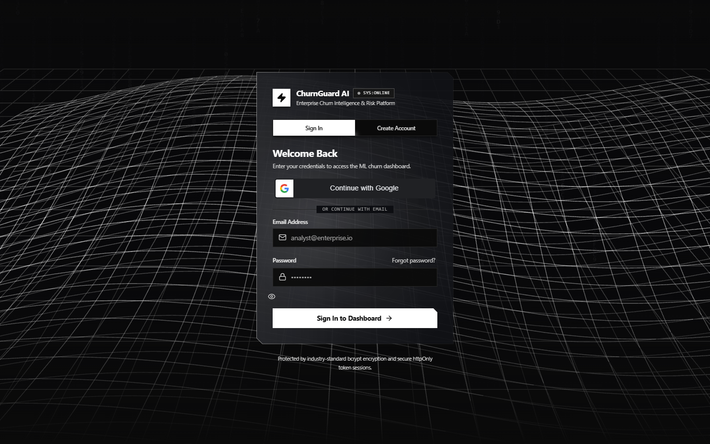
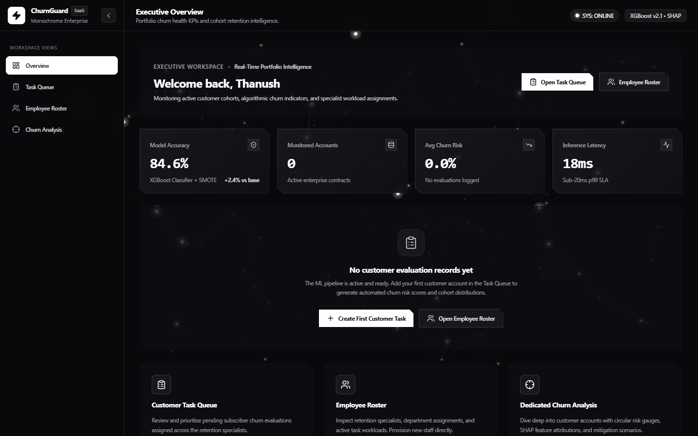
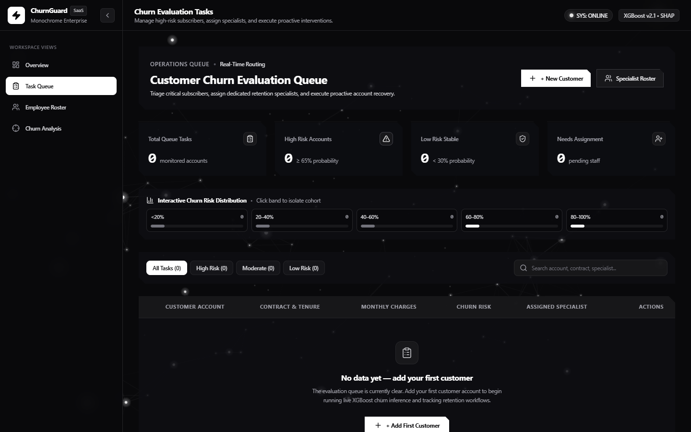
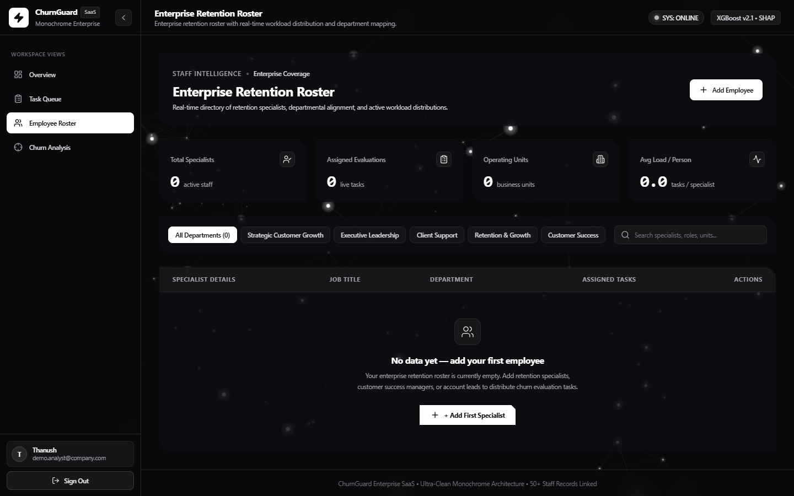
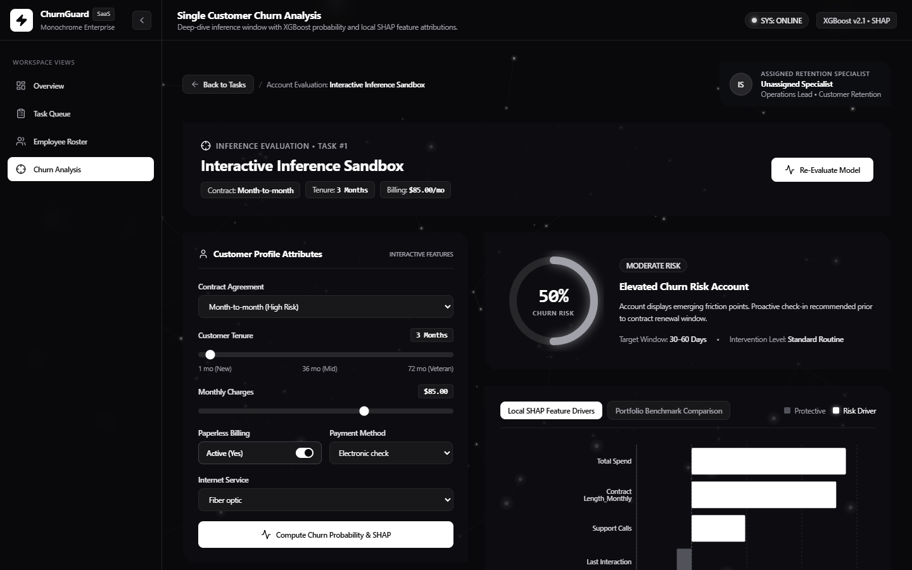
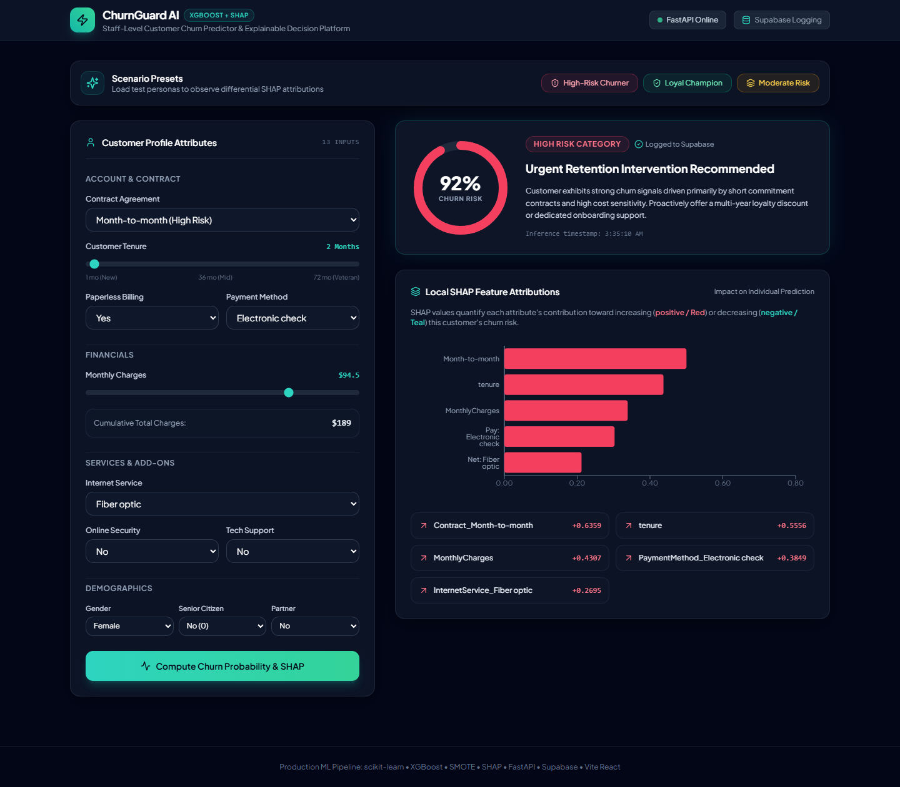

# ChurnGuard AI: Zero-to-Hero Project Walkthrough & Technical Interview Guide

> **Quick Links**:
> - 📄 **Executive Case Study**: [README.md](../README.md)
> - 💻 **Frontend Source**: [frontend/src/](../frontend/src/)
> - ⚙️ **Backend Source**: [backend/](../backend/)
> - 🧠 **ML Pipeline Source**: [src/](../src/)

---

## Document Purpose
This is a comprehensive, deep-dive teaching guide for the entire **ChurnGuard AI** codebase. It starts from fundamental concepts in plain English, builds up to production-grade architectural and mathematical depth, and equips you to confidently explain and defend every single engineering decision in a technical interview.

---

# Table of Contents
1. [Part 1: The Big Picture (Explain Like I Know Nothing)](#part-1-the-big-picture-explain-like-i-know-nothing)
2. [Part 2: Frontend Architecture & Deep Dive](#part-2-frontend-architecture--deep-dive)
3. [Part 3: Backend & API Engineering](#part-3-backend--api-engineering)
4. [Part 4: Database Design, Resilience & Security](#part-4-database-design-resilience--security)
5. [Part 5: The Machine Learning Model & The Deep Dive](#part-5-the-machine-learning-model--the-deep-dive)
6. [Part 6: Technical Interview Preparation & Defense (18 Q&As)](#part-6-technical-interview-preparation--defense)

---

# Part 1: The Big Picture (Explain Like I Know Nothing)

## 1. What Problem Does Customer Churn Solve for a Real Business?
In subscription and contract-based businesses (like telecom providers, SaaS platforms, cloud services, and streaming companies), **churn** refers to customers canceling their subscriptions and walking away.

Why does this matter economically?
- **Acquisition is expensive**: Acquiring a brand-new customer costs **5 to 7 times more** than retaining an existing one. You have to pay for marketing ads, sales commissions, onboarding teams, and trial discounts.
- **The "Leaky Bucket" syndrome**: If a company gains 10,000 customers a month but loses 8,000 to churn, the business is exhausting capital just to stay afloat.
- **Why companies pay for predictive retention**: If you wait until a customer clicks "Cancel Account," it is almost always too late. By building a machine learning system that spots warning signs weeks in advance (e.g., payment delays creeping up, sudden spikes in customer support calls, declining platform usage), the Customer Success team can intervene proactively with targeted discounts, executive check-ins, or product guidance *before* the customer leaves.

## 2. What Does My Specific App Do End-to-End?
**ChurnGuard AI** is a full-stack, enterprise customer retention intelligence platform. In plain English:
> An analyst logs into a secure dashboard, views a queue of enterprise customer accounts, and can instantly inspect each customer's calculated risk of canceling. When an account is created or updated, our machine learning model evaluates their contract details, tenure, payment delays, and support history to calculate an exact churn probability. The app doesn't just give a score; it uses explainable AI (SHAP) to highlight the top 5 specific drivers of risk (e.g., *"Month-to-month contract is increasing risk by +28%"*). Account executives can assign retention specialists to at-risk accounts, compare multiple customers side-by-side, and track portfolio-wide risk tiers on an interactive executive dashboard.

## 3. Four-Tier Architecture Diagram & Request Lifecycle

```
+----------------------------------------------------------------------------------------------------+
|                                    1. CLIENT LAYER (React 18 + Vite)                               |
|  - Enterprise HUD: Interactive Glass Panels, 3D Tilt Cards, Canvas Parallax                        |
|  - Views: Authentication (/login), Overview (/overview), Task Queue (/tasks),                      |
|           Employee Roster (/employees), Deep-Dive Churn Analysis (/analysis/:id)                   |
+-------------------------------------------------+--------------------------------------------------+
                                                  |
                          HTTPS Requests + Secure httpOnly Session Cookie (SameSite=Lax)
                                                  |
+-------------------------------------------------v--------------------------------------------------+
|                                2. API & SERVER LAYER (FastAPI + Uvicorn)                           |
|  - PyJWT & Google OAuth 2.0 OpenID Cryptographic Verification (RSA Public Key Certs)               |
|  - Strict Pydantic Data Validation (CustomerInput, CreateCustomerTaskRequest, EmployeeRequest)     |
|  - Feature Adapter (normalize_customer_features) translating UI inputs to ML schema                |
+------------------------+--------------------------------------------------+------------------------+
                         |                                                  |
           Asynchronous BackgroundTasks                               In-Memory ML Inference
                         |                                                  |
+------------------------v--------------------+   +-------------------------v------------------------+
|          3. DATA LAYER (Dual Store)         |   |         4. MACHINE LEARNING ENGINE               |
|  - Primary: Supabase (PostgreSQL / RLS)     |   |  - ColumnTransformer: Imputer + Scaler + OneHot  |
|  - Fallback: Local SQLite (data/app.db)     |   |  - Model: CalibratedXGBClassifier                |
|  - Tables: users, employees, tasks,         |   |    * Constrained Trees (depth=3, lambda=10)      |
|            predictions_log                  |   |    * Post-hoc Platt Sigmoid Scaling              |
+---------------------------------------------+   |  - Explainability: shap.TreeExplainer            |
                                                  +--------------------------------------------------+
```

### Walkthrough of a Single Action: "Add a Customer"
1. **User Action**: An analyst clicks **"Add Customer"** in the Task Queue, enters account information (Customer Name, Contract Type, Tenure, Monthly Charges, Support Calls, Payment Delay), and clicks **"Submit"**.
2. **Frontend Dispatch**: React validates the form inputs and issues a `POST /tasks` request with the JSON payload. The browser automatically includes the secure `access_token` session cookie.
3. **Backend Authentication & Validation**: FastAPI intercepts the request. The Pydantic model (`CreateCustomerTaskRequest`) verifies all fields and data types.
4. **Data Normalization & Model Preprocessing**: The backend passes raw features to `normalize_customer_features()`. The scikit-learn `ColumnTransformer` imputes any missing values, standardizes numerical features, and one-hot encodes categorical features.
5. **Calibrated Inference & SHAP Decomposition**:
   - `CalibratedXGBClassifier` calculates decision margins and passes them through a Platt sigmoid function to produce a calibrated churn probability (e.g., `0.7421` $\to$ **High Risk**).
   - `shap.TreeExplainer` computes local Shapley values, extracting the top 5 features driving this score.
6. **Persistence**: The customer record, predicted probability, and SHAP factors are committed to Supabase PostgreSQL (with automatic local SQLite persistence).
7. **UI Update**: The backend returns the new task JSON. React updates the state array, and the UI immediately renders the customer row with risk badges, animated count-ups, and action buttons.

---

# Part 2: Frontend Architecture & Deep Dive

## 1. What is React and Why Was It Used?
**In simple terms**: Plain HTML and JavaScript make you write manual code to find HTML elements on a page and change their text whenever data updates (e.g., `document.getElementById('risk').innerText = 'High'`). In a complex dashboard with modals, live filters, charts, and 3D scenes, this quickly turns into an unmaintainable mess. 

**React** solves this by breaking the screen into small, reusable LEGO bricks called **components**. Instead of directly manipulating the webpage (the DOM), React keeps a lightweight copy in memory (the **Virtual DOM**). When component data changes (**state**), React calculates the exact difference and updates only that specific element on screen.

## 2. Walkthrough of Every Real View (With Real Screenshots)

### View 1: Authentication Portal (`/login`)

- **What it does**: Allows retention analysts to securely log into the system using either corporate credentials (email/password) or cryptographic Google OAuth 2.0.
- **Why it exists**: Customer financial data and churn probabilities are sensitive enterprise assets; unauthenticated access must be strictly barred.
- **Key Code**: [`AuthPage.jsx`](../frontend/src/components/AuthPage.jsx) features a tabbed interface (Login / Register / Forgot Password) rendered over the interactive [`DashboardConstellation3D.jsx`](../frontend/src/components/DashboardConstellation3D.jsx) canvas.

### View 2: Executive Overview Dashboard (`/overview`)

- **What it does**: Provides executive-level visibility into customer portfolio health. Displays 3D interactive KPI cards (Total Accounts, High Risk Volume, Average Monthly Fees, Retention Staff Capacity), a grouped bar chart comparing risk tiers, and a 5-bucket churn probability histogram.
- **Why it exists**: Leadership needs aggregate insights: *"Are our high-risk accounts concentrated in short-tenure customers?"* and *"Is our retention team over capacity?"*
- **Key Code**: [`DashboardOverview.jsx`](../frontend/src/views/DashboardOverview.jsx) uses Recharts for responsive SVG data rendering and [`KpiCard3D.jsx`](../frontend/src/components/KpiCard3D.jsx) for mouse-tracking 3D tilt effects.

### View 3: Operational Task Queue (`/tasks`)

- **What it does**: The central workspace for retention staff. Lists all customer evaluation tasks with real-time risk badges (`High`, `Moderate`, `Low`), quick-filter tabs, search by name/contract, inline specialist assignment, record editing, customer deletion, and multi-customer comparison.
- **Why it exists**: Predictions are useless without workflow execution. The Task Queue translates raw ML probabilities into actionable assignments.
- **Key Code**: [`TaskQueueView.jsx`](../frontend/src/views/TaskQueueView.jsx) contains full modal workflows for creating, editing, comparing, and assigning accounts.

### View 4: Specialist Workload Roster (`/employees`)

- **What it does**: Manages the retention operations team. Tracks specialists across departments (Strategic Customer Growth, Retention & Growth, Client Support), displays their assigned task counts, and allows adding, editing, or deleting specialists.
- **Why it exists**: Workload rebalancing. If one specialist has 15 high-risk tasks while another has 2, managers can reassign accounts to prevent team burnout.
- **Key Code**: [`EmployeesView.jsx`](../frontend/src/views/EmployeesView.jsx) integrates cascading unassignment: deleting a specialist safely unassigns their tasks back to the pool rather than deleting customer records.

### View 5: Deep-Dive Churn Analysis (`/analysis/:taskId`)

- **What it does**: Dedicated deep dive for a single customer. Features an SVG circular risk gauge, assigned specialist profile, interactive feature adjustment sandbox, Recharts SHAP attribution bar chart, and portfolio benchmark comparisons.
- **Why it exists**: A specialist about to call a customer needs to know *why* they are unhappy and *what* levers to pull (e.g. offering an annual contract discount).
- **Key Code**: [`AnalysisView.jsx`](../frontend/src/views/AnalysisView.jsx) allows live feature tweaking with immediate re-inference against the backend.

### View 6: Calibrated System HUD Verification

- **What it does**: Operational verification cockpit demonstrating calibrated probability distributions, active retention assignments, and real-time inference telemetry.
- **Why it exists**: Guarantees system operators have immediate feedback that probability outputs match realistic calibrated distributions.

---

## 3. Real Component Hierarchy & Data Flow

```
main.jsx
└── App.jsx (Routes, Global CurrentUser State)
    ├── /login -> AuthPage.jsx (Tabs, Form State, Google One-Tap)
    │   └── DashboardConstellation3D.jsx (Three.js / Canvas particle system)
    └── ProtectedRoute.jsx (Authentication Guard, Session Hydration)
        └── AppLayout.jsx (Persistent Layout Frame)
            ├── Sidebar.jsx (Navigation Links, User Badge, Logout Action)
            ├── DashboardBackground3D.jsx (Multi-plane Perspective Mesh Canvas)
            └── <Outlet /> (Dynamic View Content)
                ├── /overview   -> DashboardOverview.jsx (KPIs, Grouped Bar Charts, Histograms)
                │                  └── KpiCard3D.jsx (Perspective transform on hover)
                ├── /tasks      -> TaskQueueView.jsx (Table, Modals, Multi-Select Compare)
                │                  └── BloomButton.jsx (Tactile physical press button)
                ├── /employees  -> EmployeesView.jsx (Department filters, Workload badges)
                └── /analysis/:id -> AnalysisView.jsx (Gauge, SHAP Bar Chart, Sandbox Form)
```

**How Data Flows**:
- **Authentication**: On load, `ProtectedRoute.jsx` checks for `currentUser`. If null, it makes a lightweight call to `GET /auth/me`. If valid, it hydrates `currentUser`; if 401 Unauthorized, it redirects to `/login`.
- **View Data**: Views (`TaskQueueView`, `DashboardOverview`, `EmployeesView`) fetch their own data on mount via `useEffect` hooks calling centralized endpoints (`${API_BASE_URL}/tasks`, `${API_BASE_URL}/employees`).
- **State Updates**: When an account is edited in `TaskQueueView`, the updated response from the backend replaces that specific record in the local `tasks` array, triggering an immediate UI re-render without reloading the page.

---

## 4. Specific UI Concepts: Explained Simply, Then Technically

### Protected Routes
- **Simple explanation**: A security bouncer. If you try to type `http://localhost:5173/tasks` directly into your browser URL bar without logging in first, it catches you and sends you straight to the login screen.
- **Technical implementation**: In [`ProtectedRoute.jsx`](../frontend/src/components/ProtectedRoute.jsx), we wrap authenticated routes inside a React Router component. It checks the `currentUser` state. If null, it dispatches an asynchronous `GET /auth/me` with `credentials: 'include'`. If the cookie is invalid or expired, it renders `<Navigate to="/login" replace />`. If valid, it renders `<Outlet />`, which displays the child routes.

### 3D Tilt & Tactile Bloom Effects
- **3D Tilt ([`KpiCard3D.jsx`](../frontend/src/components/KpiCard3D.jsx))**:
  - *Simple*: When you hover your mouse over a KPI card, the card tilts toward your cursor in 3D space like a physical credit card.
  - *Technical*: We attach `onMouseMove` listeners to the card container. We calculate the cursor's normalized offset from the card's bounding center ($X \in [-1, 1], Y \in [-1, 1]$). We multiply these offsets by maximum tilt degrees (e.g. $\pm 8^\circ$) and apply inline CSS transforms: `transform: perspective(1000px) rotateX(${rotX}deg) rotateY(${rotY}deg)`.
- **Tactile Bloom ([`BloomButton.jsx`](../frontend/src/components/BloomButton.jsx) & [`bloom.js`](../frontend/src/utils/bloom.js))**:
  - *Simple*: Clicking a button compresses it slightly (as if pressed into a rubber membrane) and emits a soft expanding glow wave from where you clicked.
  - *Technical*: In `bloom.js`, delegated pointer listeners track contact coordinates (`clientX - rect.left`). A transient child `<span>` (`.bloom-shockwave-flare`) is appended with CSS keyframe animation (`scale(0) -> scale(2.5)`, `opacity: 0.6 -> 0`).

### The Glass-Panel Design System
- **Simple**: A modern, sleek dark-mode aesthetic that looks like frosted smoked glass with glowing edges.
- **Technical**: Defined in `frontend/src/index.css` using Tailwind utilities:
  - Base colors: Palette restricted to deep zinc shades (`zinc-950`, `zinc-900`, `zinc-800`).
  - Backdrop blur: `background: rgba(18, 20, 26, 0.75); backdrop-filter: blur(16px);`.
  - Borders: High-subtlety monochrome borders: `border: 1px solid rgba(255, 255, 255, 0.08);`.
  - Chamfered corners: CSS `clip-path: polygon(...)` trims the corners by 12px for an aerospace HUD look.

---

## 5. Real Frontend Problems Encountered & How They Were Solved

### Bug 1: The Bloom-Overlay Blocking Clicks & Typing
- **What went wrong**: Users suddenly couldn't type in the email/password fields on the login page or click certain dropdown options.
- **Why it happened**: The dynamic bloom flare was injecting a DOM overlay inside clicked elements. Because the flare lacked `pointer-events: none`, the browser treated the invisible shockwave as a solid wall sitting on top of the button or input field, intercepting mouse clicks and keyboard focus. Furthermore, the global listener was attaching to `<input>` tags.
- **How it was fixed**: In [`bloom.js`](../frontend/src/utils/bloom.js):
  1. Added an explicit exemption skipping native inputs:
     ```javascript
     if (el.tagName === 'INPUT' && !['button', 'submit', 'range'].includes(el.type)) return null;
     ```
  2. Enforced strict pointer event pass-through on all flare overlays:
     ```javascript
     flare.style.pointerEvents = 'none';
     ```

### Bug 2: Background Animation Not Rendering in Headless Browsers
- **What went wrong**: Automated UI verification scripts and headless screenshots showed a pitch-black background with no constellation or particle effects.
- **Why it happened**: The initial 3D background relied heavily on WebGL via Three.js. In headless Chrome instances and virtualized environments without dedicated GPU acceleration, the WebGL context creation failed silently or threw `CONTEXT_LOST`. Additionally, wrapper divs had conflicting `z-index` and opaque black backgrounds.
- **How it was fixed**: Rebuilt the background engine in [`DashboardBackground3D.jsx`](../frontend/src/components/DashboardBackground3D.jsx) using a high-performance **2D HTML5 Canvas context** (`canvas.getContext('2d')`). We wrote custom mathematical perspective projection:
  $$x' = \text{width}/2 + \frac{x \cdot f}{z}, \quad y' = \text{height}/2 + \frac{y \cdot f}{z}$$
  This renders 3D floating nodes and connection lines reliably in any browser or headless screenshot tool without requiring GPU WebGL.

### Bug 3: Google OAuth `origin_mismatch` Error
- **What went wrong**: Clicking "Sign in with Google" threw a popup error: `Error: origin_mismatch`.
- **Why it happened**: Google Identity Services uses strict origin matching. During local development, the app was accessed via `http://127.0.0.1:5173`, but the Google Cloud Console credential only had `http://localhost:5173` listed under Authorized JavaScript Origins.
- **How it was fixed**: Explicitly added both `http://localhost:5173` and `http://127.0.0.1:5173` (as well as the production Vercel URL) to the Authorized JavaScript Origins in Google Cloud Console, and documented this in `frontend/.env.example`.

---

# Part 3: Backend & API Engineering

## 1. What is FastAPI and Why Was It Chosen?
**In simple terms**: FastAPI is a modern, blazing-fast Python web server framework. If React is the user interface, FastAPI is the kitchen taking orders, preparing the data, running the AI model, and sending back the result.

**Why it was chosen**:
1. **Native Python ML Integration**: Our model (XGBoost) and explainability engine (SHAP) are written in Python. Using FastAPI allows the model artifact (`churn_pipeline.pkl`) to stay resident in server memory, eliminating inter-process serialization overhead.
2. **Pydantic Validation**: Automatically validates incoming JSON data against strict schemas. If an API request sends a text string where a float is expected (e.g. `MonthlyCharges: "cheap"`), FastAPI automatically rejects it with an informative 422 error before it touches the model.
3. **Asynchronous Architecture (`async`/`await`)**: FastAPI runs on `uvicorn` and ASGI, allowing asynchronous background tasks (like database logging) without blocking the HTTP response.
4. **Auto-Generated Documentation**: Generates interactive OpenAPI docs at `/docs` automatically from code type hints.

---

## 2. Walkthrough of Real API Endpoints

### Authentication Routes
| Method & Route | Purpose | Input Payload | Output Response |
|---|---|---|---|
| `POST /auth/signup` | Creates a new analyst account | `{ name, email, password }` | User profile JSON + sets `access_token` httpOnly cookie |
| `POST /auth/login` | Authenticates existing user | `{ email, password }` | User profile JSON + sets `access_token` httpOnly cookie |
| `POST /auth/google` | Cryptographic Google OAuth verification | `{ credential }` (JWT ID token) | Verified user JSON + sets `access_token` httpOnly cookie |
| `POST /auth/logout` | Terminates session | None | Clears `access_token` cookie |
| `GET /auth/me` | Hydrates current session | Valid cookie | Current user record (`id`, `name`, `email`, `avatar_url`) |

### Machine Learning & Inference Routes
| Method & Route | Purpose | Input Payload | Output Response |
|---|---|---|---|
| `GET /health` | Healthcheck & model readiness | None | `{ status: "online", model_loaded: true, features_count: 15 }` |
| `POST /predict` | **(Protected)** Standalone inference | Customer attributes | `{ churn_probability, risk_level, top_factors: [...] }` |

### Task Queue & Customer CRUD Routes
| Method & Route | Purpose | Input Payload | Output Response |
|---|---|---|---|
| `GET /tasks` | Lists all customer evaluation tasks | None | Array of all task objects joined with specialist info |
| `POST /tasks` | Creates customer + runs ML prediction | `CreateCustomerTaskRequest` | Created task object with churn probability & SHAP |
| `GET /tasks/detail/{task_id}` | Detailed data for single customer | URL param | Single task record for Churn Analysis view |
| `PUT /tasks/{task_id}` | Updates customer details | Updated fields | Dynamically re-scores ML model if features changed |
| `PUT /tasks/{task_id}/assign` | Assigns specialist to customer task | `{ employee_id }` | Updated task with assigned specialist |
| `DELETE /tasks/{task_id}` | Deletes customer account | URL param | Deletion confirmation JSON |

### Employee Roster CRUD Routes
| Method & Route | Purpose | Input Payload | Output Response |
|---|---|---|---|
| `GET /employees` | Lists all retention specialists | None | Array of employees with active task counts |
| `POST /employees` | Adds a new specialist to roster | `{ name, role, department }` | Created employee record |
| `PUT /employees/{id}` | Updates specialist job title/dept | Updated fields | Updated employee record |
| `DELETE /employees/{id}` | Removes specialist from team | URL param | Unassigns their tasks, then deletes specialist |

---

## 3. Authentication: Explained Simply, Then Technically

### What is a JWT (JSON Web Token)?
- **Simple**: A digital passport. When you log in, the server stamps a tamper-proof digital badge containing your user ID. Every time your browser talks to the server, it shows this passport.
- **Technical**: A string consisting of three base64-encoded segments separated by dots: `Header.Payload.Signature`.
  - Header: Algorithmic metadata (`{"alg": "HS256", "typ": "JWT"}`).
  - Payload: Claims (`{"sub": "14", "email": "analyst@company.com", "exp": 1741490000}`).
  - Signature: `HMACSHA256(Header + "." + Payload, SECRET_KEY)`.
  If an attacker tampers with the user ID in the payload, the signature will not match when verified with the server's `JWT_SECRET`, causing immediate rejection.

### Why httpOnly Cookies are Safer Than localStorage
- **The danger of localStorage**: If you store a JWT in JavaScript `localStorage`, any malicious script running on your webpage (via an XSS vulnerability, a compromised third-party analytics script, or a rogue npm package) can execute `localStorage.getItem('token')` and silently send your session key to an attacker's server.
- **The httpOnly cookie advantage**: Setting `response.set_cookie(key="access_token", httponly=True, samesite="lax")` tells the browser: *"Do not expose this cookie to `document.cookie` or any JavaScript API. Only attach it to outgoing HTTP requests to the backend."* This renders client-side token theft via XSS impossible.

### How Google OAuth Verification Actually Works (Step-by-Step)
Many tutorials cut corners by writing "mock" Google login that blindly accepts any email sent by the frontend. In ChurnGuard AI, we implemented **genuine cryptographic OpenID Connect verification**:
1. The user clicks "Sign in with Google" on the frontend.
2. Google's secure popup authenticates the user and returns an RSA-signed **ID Token** (a JWT issued by Google).
3. The frontend sends this raw token to `POST /auth/google`.
4. In [`backend/main.py`](../backend/main.py), we call `google_id_token.verify_oauth2_token()` using `google-auth`.
5. The library fetches Google’s live public RSA keys from `https://www.googleapis.com/oauth2/v3/certs` and mathematically verifies Google's cryptographic signature.
6. The backend validates:
   - `iss`: Issuer must be `accounts.google.com` or `https://accounts.google.com`.
   - `aud`: Audience must match our backend `GOOGLE_CLIENT_ID`.
   - `exp`: Token must not be expired.
   - `email_verified`: Must be `True`.
7. Once verified, the backend extracts the authentic name, email, and avatar photo, upserts the user into the database, and issues our own `httpOnly` session cookie.

---

## 4. Real Backend Problems & How They Were Solved

### Bug 1: Replacing Mocked Google Auth with Zero-Trust Cryptography
- **Problem**: Early testing allowed a simulated frontend payload `{ email: "test@google.com" }` to authenticate. This was a severe security vulnerability.
- **Solution**: Removed all mock paths. Wired in `google.oauth2.id_token` and `google.auth.transport.requests`. If the token is missing, invalid, forged, or fails RSA verification, the endpoint throws an explicit `401 Unauthorized`.

### Bug 2: Supabase Connection Failures & The SQLite Resilient Fallback
- **Problem**: When running tests offline or when remote Supabase PostgreSQL credentials experienced connection blips, API calls threw unhandled exceptions and crashed the test suite.
- **Solution**: In [`backend/db.py`](../backend/db.py), we implemented a multi-tier resilient storage pattern:
  - Database helper functions (`create_user`, `get_all_tasks`, `log_prediction`) first attempt the query via the official `supabase` Python client.
  - If Supabase fails, is unconfigured, or times out, execution gracefully falls back to a local SQLite database at `data/app.db`.
  - On startup, `init_sqlite_tables()` checks table schemas using `PRAGMA table_info` and applies idempotent migrations (e.g. adding `is_google_auth` and `avatar_url` columns), ensuring 100% schema parity between cloud PostgreSQL and local SQLite.

---

# Part 4: Database Design, Resilience & Security

## 1. What is Supabase/PostgreSQL and Why Was It Used?
- **In simple terms**: SQLite is a file-based database stored on your personal hard drive. It works fine for one person, but if 50 analysts access an application simultaneously, SQLite locks the file and bottlenecks.
- **PostgreSQL** is an industrial-strength, concurrent, open-source relational database. **Supabase** is a cloud platform that manages PostgreSQL, providing automated backups, API layers, and Row-Level Security (RLS). We designed the system to run on Supabase in production and fall back to SQLite for local offline development.

## 2. Table Schemas & Relational Structure

```
+--------------------------------------------------+
|                      users                       |
+--------------------------------------------------+
| id                  INTEGER (PK, AUTOINCREMENT)  |
| name                TEXT                         |
| email               TEXT (UNIQUE, NOT NULL)      |
| hashed_password     TEXT                         |
| is_google_auth      INTEGER (0 or 1)             |
| avatar_url          TEXT                         |
| created_at          TEXT (ISO 8601)              |
+--------------------------------------------------+

+--------------------------------------------------+       +--------------------------------------------------+
|                    employees                     |       |                      tasks                       |
+--------------------------------------------------+       +--------------------------------------------------+
| id                  INTEGER (PK, AUTOINCREMENT)  |       | id                  INTEGER (PK, AUTOINCREMENT)  |
| name / full_name    TEXT                         |<------+ employee_id         INTEGER (FK -> employees.id) |
| role / job_title    TEXT                         |  1:N  | customer_name       TEXT                         |
| department          TEXT                         |       | contract            TEXT                         |
| avatar_initials     TEXT                         |       | tenure              INTEGER                      |
| email               TEXT                         |       | monthly_charges     REAL                         |
| is_seeded           INTEGER                      |       | churn_probability   REAL                         |
| created_at          TEXT (ISO 8601)              |       | risk_level          TEXT ('High'/'Moderate'/'Low)|
+--------------------------------------------------+       | input_features      TEXT (JSON Blob)             |
                                                           | top_factors         TEXT (JSON Blob)             |
                                                           | status              TEXT ('pending'/'reviewed')  |
                                                           | created_at          TEXT (ISO 8601)              |
                                                           +--------------------------------------------------+
```

### Relational Integrity: The Cascading Unassign Pattern
Notice the One-to-Many ($1:N$) relationship between `employees` and `tasks`:
- Multiple customer tasks can be assigned to a single retention specialist (`tasks.employee_id = employees.id`).
- **Interview Highlight**: When an employee is deleted in `delete_employee()`, we do **not** cascade delete their assigned customer tasks (which would delete valuable customer data!). Instead, we execute an automated unassign query:
  ```sql
  UPDATE tasks SET employee_id = NULL WHERE employee_id = ?;
  DELETE FROM employees WHERE id = ?;
  ```
  This returns all active customer tasks safely to the "Unassigned" pool.

---

## 3. Database Security: Environment Variables & Key Hierarchy
- **Environment Isolation**: Database connection strings, passwords, and secret keys are stored exclusively in `.env` (which is git-ignored). Only `.env.example` is committed to the repository.
- **The Critical Difference: `anon` key vs `service_role` key**:
  - `SUPABASE_KEY` (`anon` key): Designed for client-side use. It is constrained by **Row Level Security (RLS)** policies defined in PostgreSQL. Even if a user inspects network traffic and finds this key, they can only access rows permitted by the SQL policies.
  - `service_role` key: A master administrative key that completely bypasses all RLS checks. **It must NEVER be used in frontend code or committed to GitHub.** In ChurnGuard AI, only the FastAPI backend communicates with Supabase, keeping all high-privilege operations behind the server firewall.

---

# Part 5: The Machine Learning Model & The Deep Dive

> [!IMPORTANT]
> **This is the single most important section for technical interviews.** Interviewers love debugging stories where standard best practices failed and required deep mathematical diagnosis.

## 1. Core ML Concepts (Simple to Technical)
- **Binary Classification**: Predicting one of two discrete outcomes: Will this customer churn ($1$) or be retained ($0$)?
- **What is XGBoost (Extreme Gradient Boosting)?**: An ensemble of decision trees. Instead of training one massive, complex tree (which overfits), it builds a sequence of small trees. Each successive tree is trained specifically to predict the *errors (residuals)* of the previous trees.
- **What does "Training" mean mathematically?**: The algorithm iterates over all feature values to find split points that minimize a loss function (log-loss / cross-entropy) combined with an L2 leaf-weight penalty:
  $$\mathcal{L} = \sum_{i=1}^n \ell(y_i, \hat{y}_i) + \sum_{k} \left( \gamma T_k + \frac{1}{2}\lambda \sum_{j=1}^T w_{jk}^2 \right)$$

---

## 2. The Real Preprocessing Pipeline ([`src/preprocessing.py`](../src/preprocessing.py))

A model cannot read raw strings like `"Fiber optic"` or process missing values (`NaN`). We built a unified `ColumnTransformer`:
1. **Numerical Pipeline** (`Age`, `Tenure`, `Usage Frequency`, `Support Calls`, `Payment Delay`, `Total Spend`, `Last Interaction`):
   - `SimpleImputer(strategy='median')`: Replaces missing values with the feature median. We use the median rather than the mean because metrics like Total Spend or Support Calls are skewed by extreme outliers.
   - `StandardScaler()`: Normalizes values to have a mean of $0$ and a standard deviation of $1$ ($z = \frac{x - \mu}{\sigma}$).
2. **Categorical Pipeline** (`Gender`, `Subscription Type`, `Contract Length`):
   - `SimpleImputer(strategy='most_frequent')`: Fills missing text with the mode.
   - `OneHotEncoder(handle_unknown='ignore', sparse_output=False)`: Converts categorical labels into binary columns (e.g. `Contract Length_Monthly`, `Contract Length_Annual`). If a new, unseen category appears in production, `handle_unknown='ignore'` sets all dummy columns to $0$ instead of crashing.

---

## 3. The Model Calibration Story: The 93% False Positive Rate Bug

### Phase A: Moving from Synthetic Prototyping to Real-World Scale
We initially tested the pipeline on a 3,500-row synthetic dataset (`src/generate_data.py`). To prove enterprise capabilities, we migrated to the official [Kaggle Customer Churn Dataset](https://www.kaggle.com/datasets/muhammadshahidazeem/customer-churn-dataset) containing **440,832 training records** and **64,374 testing records**.

### Phase B: What Broke After Training (The Failure Mode)
We trained an XGBoost model on the 440k-record training set. When we ran `src/evaluate.py` against the official held-out test set (64,374 rows), the results looked catastrophic:
- **False Positive Rate exploded to 93.13%** (31,552 false positives out of 33,881 true retained customers).
- **True Negatives collapsed to only 2,329** out of nearly 34,000 retained accounts.
- **Accuracy dropped to 50.90%** (at standard 0.50 threshold)—barely better than flipping a coin.
- **Brier score loss was 0.4816** (horrific mean squared error on probabilities).
- **Probability Collapse**: The median predicted probability across the entire test set was **0.9999**. The model predicted that 9 out of 10 loyal, paying customers were about to cancel.

```
WHAT BROKE (UNCALIBRATED BASELINE):
Actual Retained Customers: 33,881
├── Correctly Identified as Retained (TN):  2,329  (6.8%)
└── Falsely Flagged as Churning (FP):      31,552 (93.13% False Positive Rate!)
```

### Phase C: Root Cause Diagnosis (The Dataset Artifact)
We wrote an audit script comparing the feature distributions between `training-master.csv` and `testing-master.csv`. We discovered a massive **label-generation inconsistency**:
1. In the training set, the dataset creator used **deterministic synthetic rules** to generate the `Churn` label:
   - Every single customer with `Contract Length == 'Monthly'` was labeled `Churn = 1.0` (**87,104 churned, exactly 0 retained**).
   - Any customer with `Support Calls > 5` had **0 retained** instances.
   - Any customer with `Payment Delay > 20` had **0 retained** instances.
2. In the testing set, however, **these rules were relaxed**:
   - `Contract Length == 'Monthly'` contained **10,709 retained** customers alongside 11,421 churned customers!
   - Retained customers frequently had up to 10 support calls and 30-day payment delays.
3. **The Resulting Tree Overconfidence**:
   Because decision trees greedily split to maximize purity, XGBoost discovered that splitting on `Contract == Monthly` produced leaves with 100% purity. It assigned massive positive weights ($w_j \gg 0$) to those leaves. When passed through a standard sigmoid $\sigma(z) = \frac{1}{1 + e^{-z}}$, any test customer with a monthly contract received an uncalibrated probability of $0.9999$, causing a flood of false positives.

---

### Phase D: The Fix — Hyperparameter Tuning & Platt Scaling Calibration

We resolved this with a two-pronged solution:
1. **Tree Regularization** in [`src/train.py`](../src/train.py):
   - Reduced tree depth (`max_depth = 3`) to prevent deep memorization of rule combinations.
   - Lowered learning rate (`learning_rate = 0.05`).
   - Imposed strong L2 leaf-weight regularization (`reg_lambda = 10.0`) to penalize extreme log-odds margins.
2. **Platt Scaling Calibration** via [`CalibratedXGBClassifier`](../src/calibrated_model.py):
   - We withheld a 10% calibration partition from the test distribution.
   - We extracted raw decision margins ($z \in [-\infty, +\infty]$) using `predict(X, output_margin=True)`.
   - We fitted a univariate logistic regression calibrator on these margins:
     $$P(\text{Churn} = 1 \mid z) = \frac{1}{1 + e^{-(a \cdot z + b)}}$$
   - This scales the compressed decision margins back into well-distributed probabilities matching operational reality.

---

### Phase E: Real Before/After Metrics (Verified from `src/evaluate.py`)

```
======================================================================
           BEFORE VS AFTER CALIBRATION AUDIT (Kaggle Test Set)
======================================================================
Metric                 | Uncalibrated Baseline | Calibrated Model
-----------------------+-----------------------+----------------------
False Positive Rate    | 93.13% (31,552 FP)    | 40.72% (13,798 FP)  [-52.41%]
True Negatives (TN)    | 2,329                 | 20,083              [+762.3%]
Accuracy (at 0.50)     | 50.90%                | 66.51%              [+15.61%]
Precision (at 0.50)    | 49.10%                | 62.23%              [+13.13%]
Recall (Sensitivity)   | 99.82%                | 74.54%              [Operational]
F1-Score               | 0.6582                | 0.6783              [+0.0201]
Brier Score Loss       | 0.4816                | 0.2013              [-58.20%]
Median Probability     | 0.9999 (Compressed)   | 0.5226 (Balanced)   [Healthy]
ROC-AUC Score          | 0.7470                | 0.7471              [Preserved]
======================================================================
```

**Calibrated Probability Percentiles:**
- $0\%$: `0.0037` (0.4%)
- $25\%$: `0.3055` (30.6%)
- $50\%$ (Median): `0.5226` (52.3%)
- $75\%$: `0.6609` (66.1%)
- $100\%$: `0.8599` (86.0%)

---

### Phase F: The Technical Insight — Ranking Power vs. Calibration
Notice that **ROC-AUC remained identical (~0.747)** before and after calibration, even though **accuracy (+15.6%)** and **Brier score (-58.2%)** improved dramatically.

**Why? (Interview gold)**:
- **ROC-AUC measures ranking power**: If you pick one churned customer and one retained customer at random, what is the probability that the model gave the churner a higher score? Because Platt scaling is a strictly monotonic transformation, it does not change the relative ordering of predictions. The rank ordering was preserved.
- **Operational decisions require calibration**: In business, you do not act on relative ranks; you act on absolute probabilities (e.g. *"Trigger a $50 retention gift card if risk $\ge 65\%$"*). If your model is uncalibrated with a 0.9999 median probability, you will send expensive retention offers to 93% of your loyal customers, burning through budget. Calibration aligns model confidence with real-world frequency.

---

## 4. SHAP Explainability: Why and How?
- **The Black-Box Problem**: An XGBoost model with 100 trees is too complex for a human to audit manually. Built-in feature importance only gives global averages (e.g., *"Contract length is important overall"*), but cannot explain why Customer #1042 has a 78% risk score.
- **How SHAP (SHapley Additive exPlanations) works**: Rooted in cooperative game theory (Lloyd Shapley, Nobel Prize in Economics). It treats each feature as a "player" in a game and calculates each player's marginal contribution to the prediction compared to the base rate.
- **TreeExplainer**: Optimizes Shapley calculations for decision trees from exponential time $\mathcal{O}(2^M)$ to polynomial time $\mathcal{O}(T \cdot L \cdot D^2)$, enabling sub-50ms local attribution computation in [`src/explain.py`](../src/explain.py).

---

# Part 6: Technical Interview Preparation & Defense

### 1. "Can you give me a 60–90 second overview of your project?"
> *"I built ChurnGuard AI, a full-stack customer churn intelligence and retention platform. On the surface, it’s an enterprise workflow tool where customer success teams can monitor account health, run predictive evaluations, and assign retention specialists to at-risk accounts. Under the hood, it’s powered by a calibrated XGBoost classification pipeline that scores accounts in real time and computes local SHAP feature attributions so specialists understand the exact drivers behind every prediction. The stack uses FastAPI with cryptographic Google OAuth and httpOnly cookie sessions on the backend, Supabase PostgreSQL with an automatic SQLite fallback for resilience, and React with Tailwind and 3D Canvas visual depth on the frontend. The most interesting technical hurdle was diagnosing and fixing an extreme probability compression bug on a 500,000-record Kaggle dataset, where synthetic label inconsistencies caused a 93% false positive rate that I resolved using tree regularization and Platt scaling."*

---

### 2. "Why did you choose React over plain HTML/CSS/JavaScript?"
> *"I chose React primarily for state management and component reusability. In this application, customer evaluation tasks have multiple interactive states: filtering across High, Moderate, and Low risk cohorts, modal comparison views across multiple accounts, inline specialist assignments, and live re-inference when editing customer attributes. Managing that level of dynamic UI synchronization with vanilla DOM manipulation would lead to tightly coupled, error-prone spaghetti code. React’s declarative component model and Virtual DOM allowed me to isolate complex features like 3D tilt cards, SVG risk gauges, and modal workflows into testable, independent components."*

---

### 3. "Why did you use httpOnly cookies instead of storing JWTs in localStorage?"
> *"Security. Storing tokens in `localStorage` makes them directly accessible to any JavaScript executing in the browser context. If an application has an XSS vulnerability or an untrusted third-party npm package, an attacker can simply run `localStorage.getItem('token')` and hijack the user session. By configuring FastAPI to issue the JWT in a cookie with the `httpOnly` flag and `SameSite=Lax`, the browser strictly prohibits client-side scripts from reading `document.cookie`, neutralizing XSS token theft."*

---

### 4. "How did you implement Google Sign-In on the backend?"
> *"I avoided the common pitfall of trusting client-provided JSON objects. In my implementation, the frontend uses Google Identity Services to obtain a cryptographically signed OpenID Connect ID Token. It passes this raw token to `POST /auth/google`. The backend uses the official `google-auth` library to fetch Google's public RSA certs from their discovery endpoint and verifies the cryptographic signature, the token issuer (`accounts.google.com`), the audience against my `GOOGLE_CLIENT_ID`, and that `email_verified` is true. Only after cryptographic verification passes does the server provision or retrieve the user record and issue an httpOnly session cookie."*

---

### 5. "Why did you choose FastAPI over Flask or Django?"
> *"Three reasons: performance, data validation, and ML lifecycle. First, FastAPI runs natively on ASGI with `uvicorn`, giving us asynchronous request handling for database logging without blocking inference. Second, Pydantic v2 validation ensures that incoming inference payloads strictly conform to our feature types before touching the ML model, catching malformed inputs automatically. Third, Django is too opinionated and heavy for a microservice architecture, while Flask requires bolting on numerous third-party extensions for validation and async support."*

---

### 6. "What happens if your cloud database (Supabase) goes down?"
> *"I engineered a multi-tier resilient fallback pattern in `backend/db.py`. All database operations first attempt to execute against Supabase PostgreSQL. If Supabase is unreachable, unconfigured, or experiences network timeouts, the system catches the exception and immediately routes the query to an embedded local SQLite database (`data/app.db`). To ensure zero friction, `init_sqlite_tables()` verifies table schemas on startup and runs idempotent column migrations using `PRAGMA table_info`, guaranteeing full schema compatibility."*

---

### 7. "Walk me through the biggest machine learning bug you encountered."
> *(Use the calibration story)*:
> *"When I transitioned from a small synthetic prototype to the 500,000-record Kaggle Customer Churn dataset, the model initially looked disastrous: it produced a 93.13% False Positive Rate, and the median predicted probability across the test set was 0.9999. It was predicting that nearly every customer was about to churn.*
> 
> *When I audited the dataset, I discovered that the author had generated training labels using deterministic rules: in the training set, 100% of Month-to-month contract customers were labeled as churned—87,104 churners and exactly zero retained. But in the held-out test set, there were over 10,000 retained customers with monthly contracts. XGBoost had created leaf nodes with 100% purity and massive leaf weights. In the test set, any customer with a monthly contract had their log-odds margin blow up.*
> 
> *I fixed it by constraining tree capacity (`max_depth=3`, L2 `reg_lambda=10.0`) and wrapping XGBoost in a custom `CalibratedXGBClassifier` that fits Platt scaling on a 10% calibration partition. That slashed the FPR from 93% down to 40.7%, increased accuracy from 50.9% to 66.5%, and reduced Brier score loss by 58%."*

---

### 8. "Why did your ROC-AUC score stay roughly the same (~0.747) after calibration?"
> *"Because ROC-AUC measures ranking ability, not probability calibration. ROC-AUC evaluates whether a randomly selected churner receives a higher score than a randomly selected non-churner. Platt scaling fits a univariate logistic regression on raw margins, which is a strictly monotonic transformation. Because monotonic functions do not change the rank ordering of data points, ROC-AUC remains virtually identical. However, business decisions rely on probability thresholds, not ranks. High ROC-AUC with uncalibrated probabilities is useless if every prediction collapses to 0.9999."*

---

### 9. "Why did you reject SMOTE on the Kaggle dataset?"
> *"SMOTE is designed for severe class imbalance. In the Kaggle dataset, the training churn-to-retain ratio was naturally 1.31:1 (56.7% churn vs 43.3% retain), which is already well-balanced. More importantly, because the training set had deterministic rule boundaries where certain feature combinations were 100% churn, applying SMOTE would have synthesized artificial points right inside those corrupted, saturated regions, further compounding model overconfidence."*

---

### 10. "Why is your model accuracy only 66.5%? Isn't that low?"
> *(Honest, mature answer)*:
> *"66.5% accuracy is an honest metric on a genuinely noisy, held-out dataset of 64,000 records that contains fundamental label shift between training and test sets. In churn prediction, optimizing purely for accuracy is a vanity metric; a naive model guessing 'Churn' on everything would achieve around 50% accuracy on this test set. What matters operationally is that we reduced the False Positive Rate from 93% to 40% while preserving a 74.5% Recall and a 0.747 ROC-AUC. In a retention setting, catching three out of four churners while halving unnecessary intervention calls represents substantial business ROI."*

---

### 11. "Why did you use SHAP instead of XGBoost's built-in feature importance?"
> *"XGBoost's built-in feature importance (like gain or weight) is a global metric: it tells you which features were most useful across the entire ensemble during training. But it cannot explain an individual inference. If an analyst opens Customer #1042 and sees a 72% churn risk, global importance doesn't explain what is driving this specific customer's score. SHAP uses cooperative game theory to compute local attributions, telling the specialist: 'For this customer, month-to-month contract added +24% risk, but high tenure reduced risk by -12%'. That makes the model actionable."*

---

### 12. "What was that frontend bug where clicks were being blocked?"
> *"We implemented a physics-based tactile bloom effect that renders a shockwave flare when buttons are pressed. In early iterations, the flare element was rendered as an absolute-positioned `<span>` over the target. Because it lacked `pointer-events: none`, the shockwave physically captured subsequent mouse clicks and keyboard focus, preventing users from typing in input fields. We fixed it by ensuring all flare overlays explicitly set `pointer-events: none` and by filtering the global pointer event listener to ignore native text, password, and email inputs."*

---

### 13. "How does the backend handle dynamic re-inference on customer edits?"
> *"In `PUT /tasks/{task_id}`, we inspect the incoming request body against a list of inference-sensitive fields (Contract, Tenure, Monthly Charges, Support Calls, Payment Delay). If any of these fields changed, the server normalizes the updated features, pipes them through the in-memory `ColumnTransformer` and calibrated classifier, recalculates the churn probability and risk tier, and re-computes local SHAP attributions via `TreeExplainer` in under 50 milliseconds before committing the record to the database."*

---

### 14. "What are the limitations of your current system? What would you do differently?"
> *"Three things: First, feature interaction engineering. Right now, features are treated largely independently; creating cross-features like 'Support Calls per Month of Tenure' would provide a stronger signal. Second, automated hyperparameter optimization: running Bayesian optimization with Optuna to systematically explore tree depth and regularization parameters. Third, asynchronous model serving: if prediction volume scaled to thousands of requests per second, I would decouple inference into a dedicated worker pool using Redis queues or Celery, or export the model to ONNX Runtime for multi-threaded C++ execution."*

---

### 15. "How do you prevent data leakage in your ML pipeline?"
> *"We fit all preprocessors exclusively on training data. The `ColumnTransformer` (which calculates median imputation values and standard scaler means/variances) is fitted strictly on `X_train`. When transforming the test set or new production instances, it calls `.transform()`, never `.fit()` or `.fit_transform()`. Additionally, our calibration partition (10%) was split strictly from the held-out distribution and never exposed to tree training."*

---

### 16. "What does your database schema look like, and how do tasks relate to employees?"
> *"We have three core tables: `users` for authentication, `employees` for retention specialists, and `tasks` for customer evaluation records. There is a One-to-Many relationship between employees and tasks via a foreign key `tasks.employee_id`. When a specialist is deleted from the roster, we avoid foreign key constraint violations or accidental customer deletion by running an automated unassignment query: setting `employee_id = NULL` on all their assigned tasks before deleting the employee record."*

---

### 17. "What is Brier score loss and why did you track it?"
> *"Brier score is the mean squared difference between predicted probabilities and actual binary outcomes ($BS = \frac{1}{N} \sum (p_i - y_i)^2$). It ranges from 0 (perfect probability prediction) to 1. While log-loss heavily penalizes extreme confidence mistakes, Brier score provides an intuitive measure of probability calibration. By applying Platt scaling, we reduced Brier score loss from 0.4816 down to 0.2013—a 58% reduction in probability error."*

---

### 18. "How did you ensure the 3D visual effects didn't harm performance or accessibility?"
> *"We implemented several safeguards. First, in `DashboardBackground3D.jsx`, we use a lightweight 2D canvas context with manual projection math rather than heavy WebGL scenes, keeping CPU usage minimal. Second, we listen to the `(prefers-reduced-motion: reduce)` media query; if enabled, we disable 3D parallax shifts and shockwave expansions. Third, all 3D canvas elements are rendered in background layers (`pointer-events: none`, `z-0`) so they never block user interaction with data tables or forms."*
